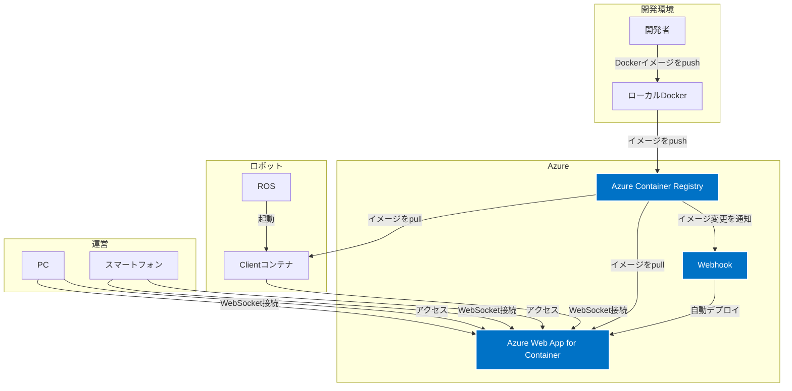
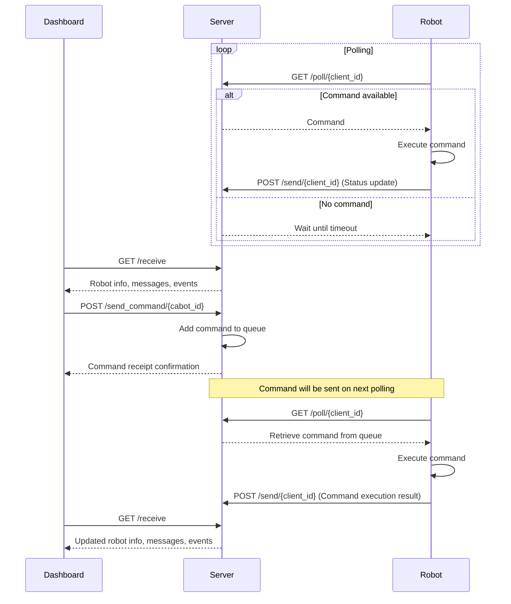

# cabot dashboard

複数のロボットを管理する仕組み

- ロボットのメトリクス状態の表示は Grafana で行う（cabot-grafana）
- ロボットの遠隔操作は、Grafanaとは別に用意するこちらの管理画面で行う

## 構成

- ロボット（dashboard-client）
  - ロボットの状態を取得する
  - ロボットの操作を実行する
- サーバー (dashboard-server)
  - ロボットの状態を表示する
  - ロボットの操作を指示する

## アーキテクチャ

- 概要図


- 構成要素はDockerで管理
  - Serverはクラウド上に構築しDockerコンテナで起動
  - ClientはAIスーツ側に配置しDockerコンテナで起動（ROS or Ubuntu）

- ロングポーリングで通信
  - ロボットとダッシュボードの間でメッセージをやり取りする

- Pythonで実装
  - サーバサイドは、FastAPIのフレームワークを利用

## 認証方式

### 管理画面認証
- Microsoft Entra ID（旧Azure AD）による認証
- JWTトークンを使用したセッション管理
- ログインセッションのタイムアウトは環境変数で設定
- ログインするとダッシュボードの右上にユーザー情報を表示
- ログアウトボタンでログアウトする

### API認証
- JWTトークンによる認証
- WebSocket接続もJWTトークンを使用
- トークンの有効期限は環境変数で設定

## メッセージ仕様


### メッセージ一覧

### ロボットからのメッセージ

ロボットからのメッセージは以下のJSON形式で送信されます:

| 項番 | 操作 | Command | CommandOption |
|------|------|---------|-----------|
| 1 | ROS起動 | ros-start |  |
| 2 | ROS停止 | ros-stop |  |
| 3 | システム再起動 | system-reboot |  |
| 4 | システム電源OFF | system-poweroff |  |
| 5 | Debug1 | debug1 |  |
| 6 | Debug2 | debug2 |  |

### メッセージサンプル

```json
{
  "target": ["cabot1", "cabot2"],
  "command": "restart",
  "commandOption": {"ProcessName": "ROS"},
  "timestamp": "2024-06-27T12:34:56Z"
}
```

## プロトタイプ

1. `cabot_dashboard_server.py` を実行してサーバーを起動します。
2. `cabot_dashboard_client.py` を実行してロボットをシミュレートします。


### シーケンス図



## Docker

起動
```
# docker-compose up -d --build
docker-compose up -d --build server
docker-compose up -d --build client
```

終了
```
docker-compose down
```

## デプロイ手順

### Server

1. azコマンドで ACR へ loginしておく

2. Dockerイメージタグをつける
  ```
  docker tag local-image-name:tag azure-image-name:tag
  ```
3. Azure Container Resistoryにpush
  ```
  docker push azure-image-name:tag
  ```
4. Azure Web App for Containersにデプロイ

- お試し環境
  - dev01-miraikan-dashboard-webapp
  - ACRへPushすると自動でデプロイ（インスタンス削除してる場合は再設定必要）

- 環境変数
  - WEBSITES_PORT = 8000
  - CABOT_DASHBOARD_LOG_LEVEL=INFO
  - CABOT_DASHBOARD_LOG_TO_FILE=false
  - CABOT_DASHBOARD_JWT_SECRET_KEY=[jwt secret key]  # JWT署名用の秘密鍵
  - CABOT_DASHBOARD_ACCESS_TOKEN_EXPIRE_MINUTES=30  # JWTトークンの有効期限（分）
  - CABOT_DASHBOARD_SESSION_TIMEOUT=1800
  - CABOT_DASHBOARD_MAX_ROBOTS=20 # Maximum number of connected robots
  - CABOT_DASHBOARD_POLL_TIMEOUT=30 # Timeout period (seconds)
  - CABOT_DASHBOARD_DEBUG_MODE=false
  - CABOT_DASHBOARD_ALLOWED_CABOT_IDS
  - MICROSOFT_CLIENT_ID=[client id]  # Microsoft Entra IDのクライアントID
  - MICROSOFT_CLIENT_SECRET=[client secret]  # Microsoft Entra IDのクライアントシークレット
  - MICROSOFT_TENANT_ID=[tenant id]  # Microsoft Entra IDのテナントID

  - ~~ WEBSITES_WEBSOCKETS_ENABLED = 1 ~~
  - https://learn.microsoft.com/ja-jp/azure/app-service/reference-app-settings?source=recommendations&tabs=kudu%2Cdotnet
  - https://learn.microsoft.com/ja-jp/answers/questions/1602711/azureappservice-4
    - AppServiceのTimeout240秒で変更不可の模様

### Client

- ロボット側で Azure Container Registry から pull
- 環境変数
  - CABOT_DASHBOARD_SERVER_URL=[URL]
  - CABOT_DASHBOARD_JWT_TOKEN=[jwt token]  # サーバーから発行されたJWTトークン
  - CABOT_DASHBOARD_LOG_LEVEL=INFO
  - CABOT_DASHBOARD_LOG_TO_FILE=false
  - CABOT_DASHBOARD_POLLING_INTERVAL=1
  - CABOT_DASHBOARD_CABOT_ID=cabot10

### Web

- サーバ側に実装
  - ローカル環境は http://localhost:8000
  - クラウド環境は https://dev01-miraikan-dashboard-webapp.azurewebsites.net
- ID、Passwordは、JSONファイルで管理とし、複数ユーザ管理できる
  - 現状利用できるアカウント
    - ID: user

## 参考）開発環境（Python仮想環境の構築）

※dockerで動かす場合はここは不要

Pythonの仮想環境を構築するコマンド。Pythonがすでにインストールされているという前提。

1. 仮想環境を作成する：

```
python -m venv env
```

ここで、`env`は仮想環境の名前です。好きな名前に変更できます。

1. 仮想環境を有効化する：

Windowsの場合：
```
myenv\Scripts\activate
```

macOSやLinuxの場合：
```
source myenv/bin/activate
```

3. 仮想環境が有効化されたら、必要なパッケージをインストールできます：

```
pip install fastapi uvicorn websockets
```

4. 仮想環境を終了する場合：

```
deactivate
```

