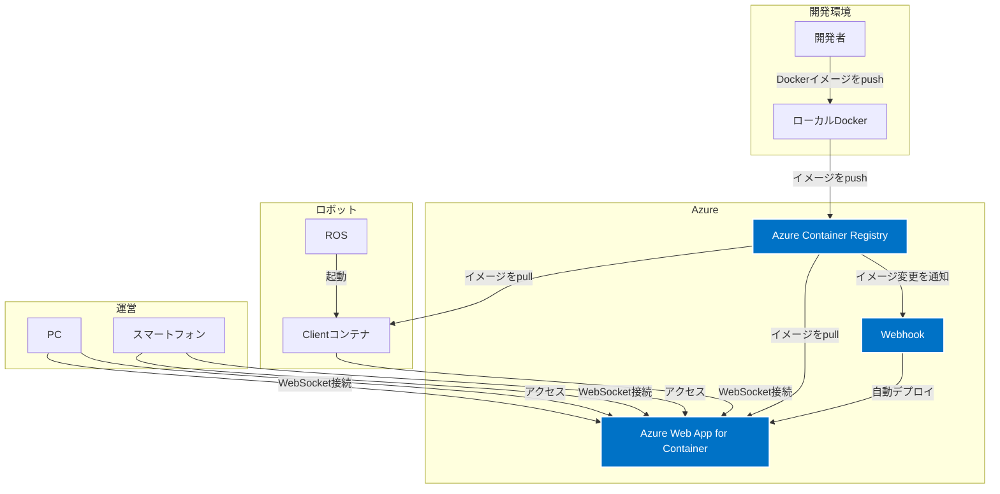
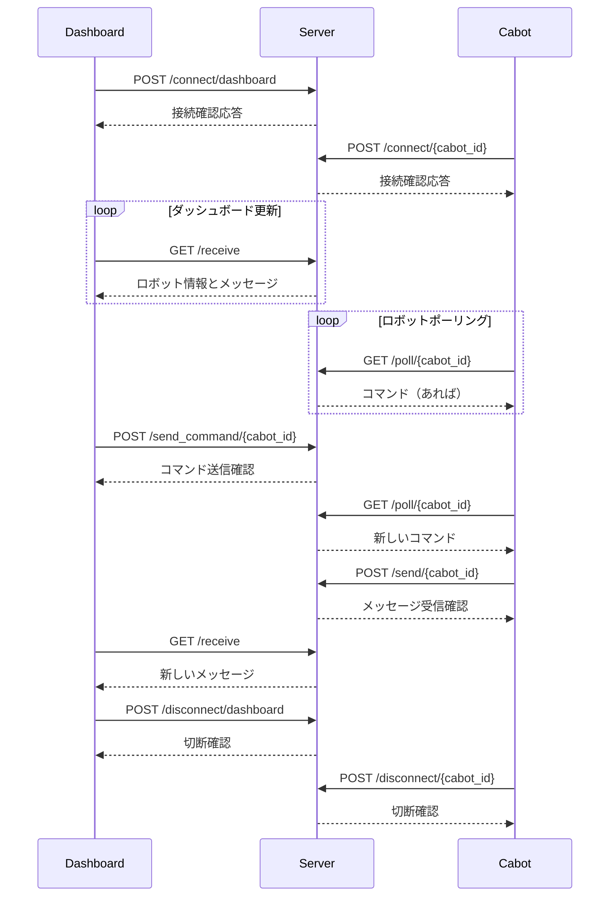

# cabot dashboard

複数のロボットを管理する仕組み

- ロボットのメトリクス状態の表示は Grafana で行う（cabot-grafana）
- ロボットの遠隔操作は、Grafanaとは別に用意するこちらの管理画面で行う

## 構成

- ロボット（dashboard-client）
  - ロボットの状態を取得する
  - ロボットの操作を実行する
- サーバー (dashboard-server)
  - ロボットの状態を表示する
  - ロボットの操作を指示する

## アーキテクチャ

- 概要図


- 構成要素はDockerで管理
  - Serverはクラウド上に構築しDockerコンテナで起動
  - ClientはAIスーツ側に配置しDockerコンテナで起動（ROS or Ubuntu）

- ロングポーリングで通信
  - ロボットとダッシュボードの間でメッセージをやり取りする

- Pythonで実装
  - サーバサイドは、FastAPIのフレームワークを利用

- API認証方式
  - APIキー認証

- 管理画面認証方式
  - ID、パスワードによるログイン認証
  - ID、パスワードは、JSONファイルで管理とし、複数ユーザ管理できる
  - ログインセッションのタイムアウトは環境変数で設定とする
  - ログインするとダッシュボードの右上にIDを表示
  - ログアウトボタンでログアウトする

## プロトタイプ

1. `main.py` を実行してサーバーを起動します。
2. `cabot.py` を実行してロボットをシミュレートします。

### シーケンス図



## Docker

起動
```
docker-compose up -d --build
```

終了
```
docker-compose down
```

## デプロイ手順

### Server

1. azコマンドで ACR へ loginしておく

2. Dockerイメージタグをつける
  ```
  docker tag cabot-dashboard-server:latest pqdev01miraikan.azurecr.io/cabot-dashboard-server:0.1
  ```
3. Azure Container Resistoryにpush
  ```
  docker push pqdev01miraikan.azurecr.io/cabot-dashboard-server:0.1
  ```
4. Azure Web App for Containersにデプロイ

- お試し環境
  - dev01-miraikan-dashboard-webapp
  - ACRへPushすると自動でデプロイ（インスタンス削除してる場合は再設定必要）

- 環境変数
  - WEBSITES_PORT = 8000
  - CABOT_DASHBOARD_API_KEY
  - CABOT_DASHBOARD_SERVER_URL (for client)
  - CABOT_DASHBOARD_LOG_LEVEL
  - CABOT_DASHBOARD_LOG_TO_FILE
  - ~~ WEBSITES_WEBSOCKETS_ENABLED = 1 ~~
  - https://learn.microsoft.com/ja-jp/azure/app-service/reference-app-settings?source=recommendations&tabs=kudu%2Cdotnet

### Client

- ロボット側で Azure Container Registry から pull

### Web

- サーバ側に実装
  - ローカル環境は http://localhost:8000
  - クラウド環境は https://dev01-miraikan-dashboard-webapp.azurewebsites.net
- ID、Passwordは、JSONファイルで管理とし、複数ユーザ管理できる
  - 現状利用できるアカウント
    - ID: user1
    - Password: password1

## 参考）開発環境（Python仮想環境の構築）

※dockerで動かす場合はここは不要
Pythonの仮想環境を構築するコマンド。Pythonがすでにインストールされているという前提。

1. 仮想環境を作成する：

```
python -m venv env
```

ここで、`env`は仮想環境の名前です。好きな名前に変更できます。

1. 仮想環境を有効化する：

Windowsの場合：
```
myenv\Scripts\activate
```

macOSやLinuxの場合：
```
source myenv/bin/activate
```

3. 仮想環境が有効化されたら、必要なパッケージをインストールできます：

```
pip install fastapi uvicorn websockets
```

4. 仮想環境を終了する場合：

```
deactivate
```

## TODO
- [ ] メッセージ仕様
- [x] API認証
- [x] 管理画面認証
- [ ] 管理画面UI設計
- [ ] 管理項目の確定
- [ ] クライアント側アクション実行
- [ ] サーバ側のデータ管理
- [ ] 性能測定
