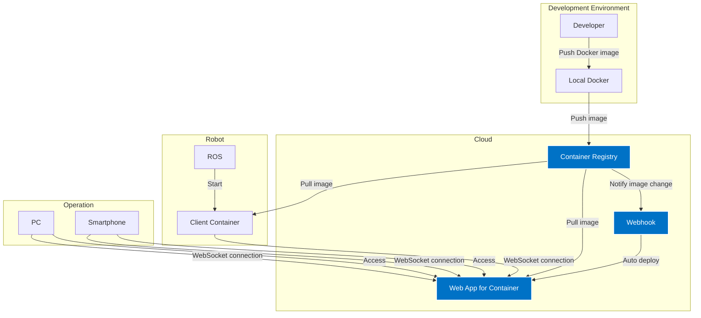
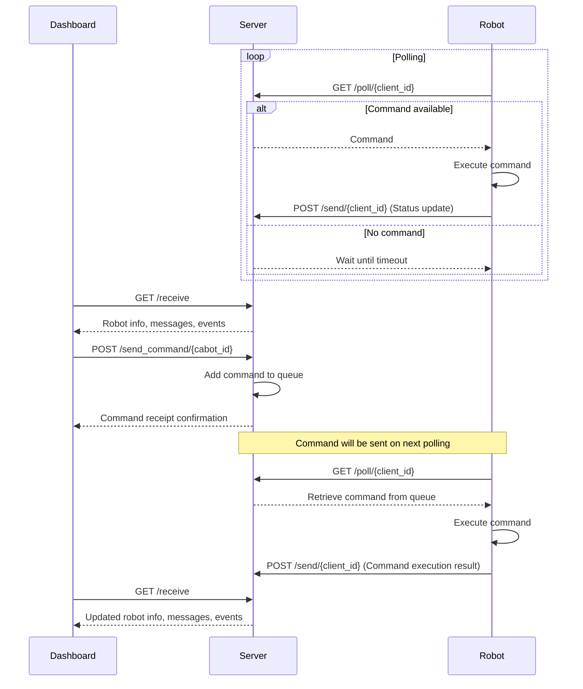

# Cabot Dashboard

A system for managing multiple robots

- Display robot metrics using Grafana (cabot-grafana)
- Remote control of robots is done through this management screen, separate from Grafana

## Configuration

- Robot (dashboard-client)
  - Retrieve robot status
  - Execute robot operations
- Server (dashboard-server)
  - Display robot status
  - Instruct robot operations

## Architecture

- Overview diagram


- Components are managed with Docker
  - Server is built on the cloud and started with a Docker container
  - Client is placed on the AI suit side and started with a Docker container (ROS or Ubuntu)

- Communication via long polling
  - Exchange messages between the robot and the dashboard

- Implemented in Python
  - Server-side uses the FastAPI framework

## Authentication Method

### Management Screen Authentication
- Authentication using Microsoft Entra ID (formerly Azure AD)
- Session management using JWT tokens
- Login session timeout is set via environment variables
- User information is displayed at the top right of the dashboard upon login
- Logout with the logout button

### API Authentication
- Authentication using JWT tokens
- WebSocket connections also use JWT tokens
- Token expiration is set via environment variables

## Message Specifications

### List of Messages

### Messages from Robots

Messages from robots are sent in the following JSON format:

| No. | Operation | Command | CommandOption |
|-----|-----------|---------|---------------|
| 1   | Start ROS | ros-start |  |
| 2   | Stop ROS | ros-stop |  |
| 3   | System Reboot | system-reboot |  |
| 4   | System Power Off | system-poweroff |  |
| 5   | Debug1 | debug1 |  |
| 6   | Debug2 | debug2 |  |

### Message Sample

```json
{
  "target": ["cabot1", "cabot2"],
  "command": "restart",
  "commandOption": {"ProcessName": "ROS"},
  "timestamp": "2024-06-27T12:34:56Z"
}
```

## Prototype

1. Run `cabot_dashboard_server.py` to start the server.
2. Run `cabot_dashboard_client.py` to simulate the robot.

### Sequence Diagram



## Docker

Build
```
./bake-docker.sh -i
```

Start
```
docker compose up -d dashboard-server
docker compose up -d dashboard-client
```

Stop
```
docker compose down
```

## Environment Variables for Server

- WEBSITES_PORT = 8000
- CABOT_DASHBOARD_LOG_LEVEL=INFO
- CABOT_DASHBOARD_LOG_TO_FILE=false
- CABOT_DASHBOARD_JWT_SECRET_KEY=[jwt secret key]  # Secret key for JWT signing
- CABOT_DASHBOARD_ACCESS_TOKEN_EXPIRE_MINUTES=30  # JWT token expiration time (minutes)
- CABOT_DASHBOARD_SESSION_TIMEOUT=1800
- CABOT_DASHBOARD_MAX_ROBOTS=20 # Maximum number of connected robots
- CABOT_DASHBOARD_POLL_TIMEOUT=30 # Timeout period (seconds)
- CABOT_DASHBOARD_DEBUG_MODE=false
- CABOT_DASHBOARD_ALLOWED_CABOT_IDS
- MICROSOFT_CLIENT_ID=[client id]  # Microsoft Entra ID client ID
- MICROSOFT_CLIENT_SECRET=[client secret]  # Microsoft Entra ID client secret
- MICROSOFT_TENANT_ID=[tenant id]  # Microsoft Entra ID tenant ID

## Environment Variables for Client

- CABOT_DASHBOARD_SERVER_URL=[URL]
- CABOT_DASHBOARD_JWT_TOKEN=[jwt token]  # JWT token issued by the server
- CABOT_DASHBOARD_LOG_LEVEL=INFO
- CABOT_DASHBOARD_LOG_TO_FILE=false
- CABOT_DASHBOARD_POLLING_INTERVAL=1
- CABOT_NAME=cabot10

## Reference: Development Environment (Python Virtual Environment Setup)

*Not needed if running with Docker*

Commands to set up a Python virtual environment. Assumes Python is already installed.

1. Create a virtual environment:

```
python -m venv env
```

Here, `env` is the name of the virtual environment. You can change it to any name you like.

2. Activate the virtual environment:

On Windows:
```
myenv\Scripts\activate
```

On macOS or Linux:
```
source myenv/bin/activate
```

3. Once the virtual environment is activated, you can install the required packages:

```
pip install fastapi uvicorn websockets
```build
```
