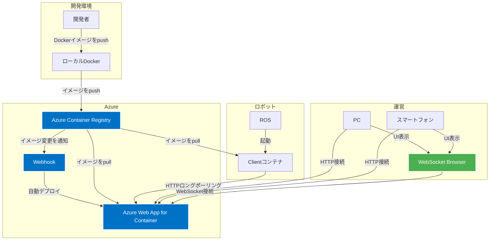
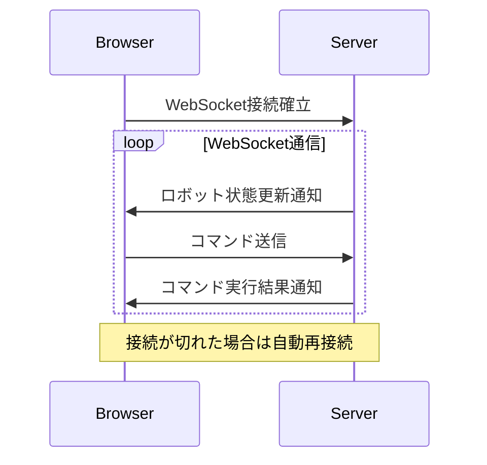
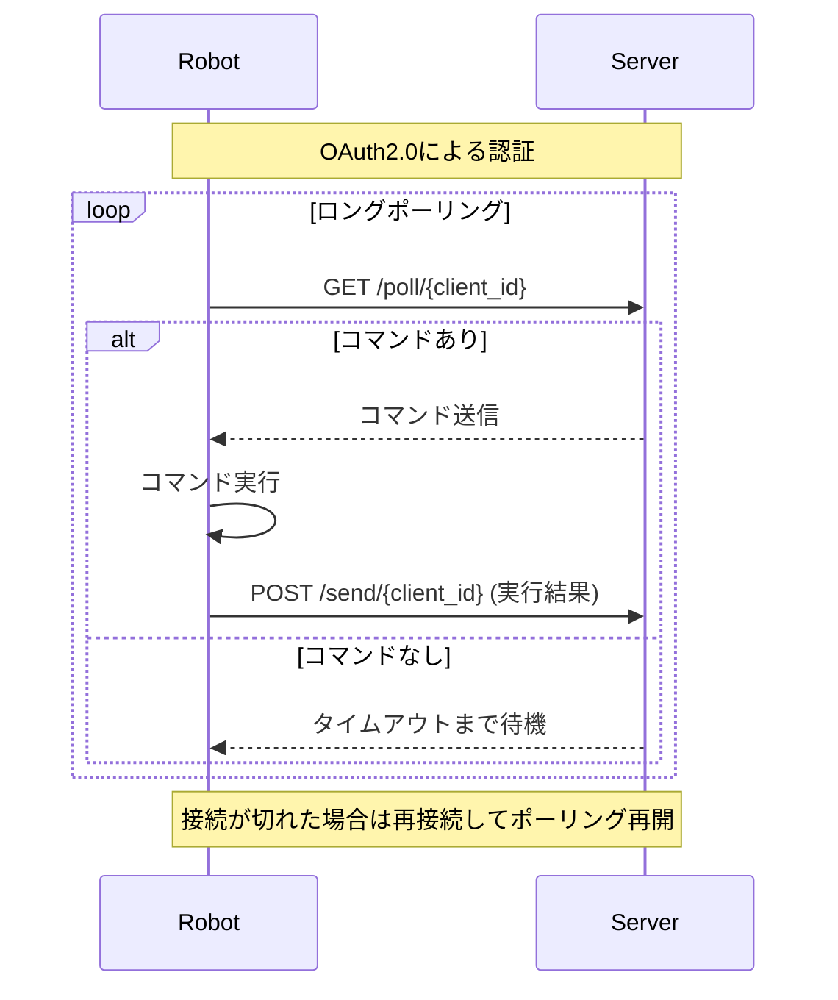

# システムアーキテクチャ

## システム概要

Cabot Dashboardは、複数のロボットを管理するためのシステムです。主な機能は以下の通りです：

- ロボットのメトリクス状態の表示（Grafana連携）
- ロボットの遠隔操作

## システム構成

### コンポーネント

1. ロボット側（dashboard-client）
   - ロボットの状態取得
   - ロボットの操作実行
   - Dockerコンテナとして実行

2. サーバー側（dashboard-server）
   - ロボットの状態表示
   - ロボットへの操作指示
   - クラウド上のDockerコンテナとして実行

### アーキテクチャ図

## 通信フロー

### ブラウザ - サーバー間通信（WebSocket）

### ロボット - サーバー間通信（HTTPロングポーリング）

### 通信プロトコル

1. ブラウザ - サーバー間（WebSocket）
   - リアルタイムな状態更新とコマンド送信
   - 自動再接続機能あり
   - JWT認証による接続確立

2. ロボット - サーバー間（HTTPロングポーリング）
   - 定期的なポーリングによるコマンド取得
   - OAuth2.0による認証
   - コマンド実行結果の送信

## 技術スタック

- 実装言語：Python
- Webフレームワーク：FastAPI
- コンテナ化：Docker
- クラウド環境：Azure（Web App for Containers）
- 認証方式：
  - API認証：APIキー認証
  - 管理画面：ID/パスワード認証

## セキュリティ

### API認証（OAuth 2.0）

- Client Credentials Flowを使用
- クライアントIDとシークレットによる認証
- JWTトークンの発行（有効期限付き）
- APIキーによる認証

### ユーザー認証（JWT）

- JWTベースのセッション管理
- パスワードのbcrypt暗号化
- セッションタイムアウト機能（環境変数で設定可能）
- クッキーベースのトークン管理
  - HTTPOnly: false（WebSocket接続のため）
  - Secure: 環境に応じて設定
  - SameSite: Lax
- ユーザー管理（JSONファイルベース）

### セキュリティ対策

- トークンの有効期限管理
- パスワードの安全な暗号化（bcrypt）
- セッションタイムアウトによる自動ログアウト
- クロスサイトリクエストフォージェリ（CSRF）対策
- 適切なエラーハンドリングとログ記録 